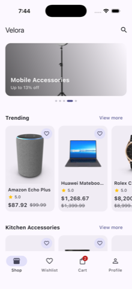
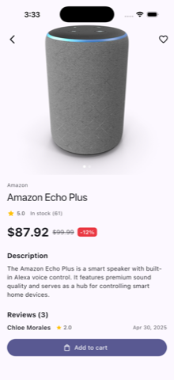
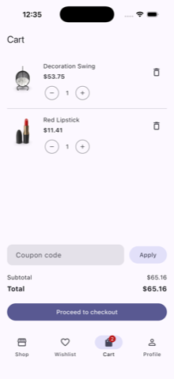
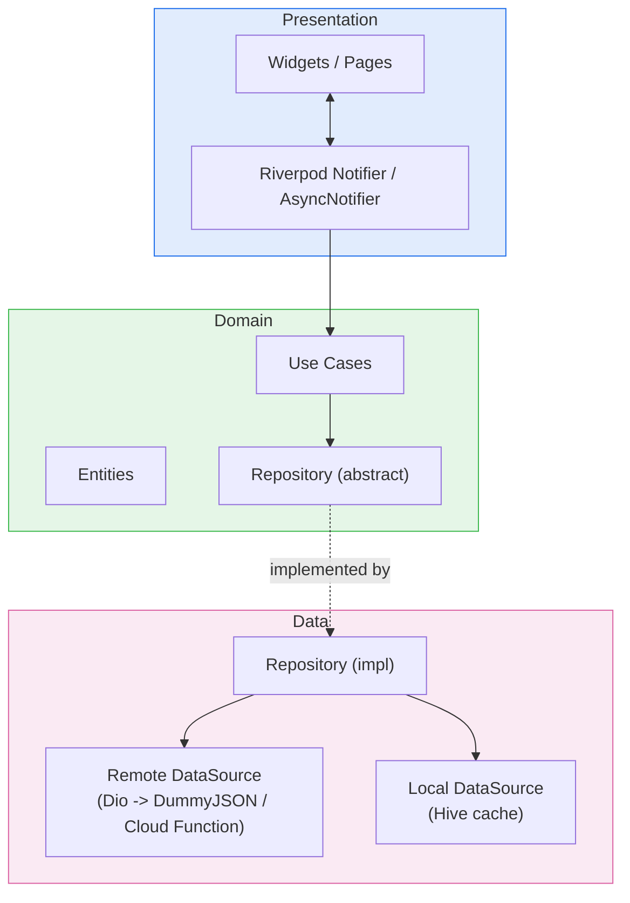

# Velora

An enterprise-grade e-commerce app built with Flutter — a production mobile architecture
showcase rather than a CRUD demo: feature-first Clean Architecture, code-generated Riverpod
state management, real Firebase Authentication (Google/Apple/email), and real Stripe
payments behind a server-verified Cloud Function. No mocked backend anywhere in the stack.

Product data comes from the [DummyJSON](https://dummyjson.com) REST API (free, keyless).
Payments run against Stripe **test mode**.

### Supported platforms

iOS and Android only, by design — the app leans on native Google/Apple sign-in flows,
platform Keychain/Keystore-backed session storage, push notifications, and a bottom-nav
mobile layout that wouldn't translate to web/desktop without real rework.

## Screenshots

<table>
<tr>
<td></td>
<td></td>
<td></td>
<td></td>
</tr>
<tr>
<td align="center">Home</td>
<td align="center">Product detail</td>
<td align="center">Cart</td>
<td align="center">Arabic (RTL)</td>
</tr>
</table>

The last shot is doing more than swapping strings: the nav bar, category chips, and grid all
mirror direction, and numerals switch to Arabic-Indic digits — see [Localization](#localization--rtl).

## Features

- **Home** — a discovery landing page: auto-sliding promo banners generated from live
  per-category discount data (no hardcoded promo content — see
  [`home_curation.dart`](lib/features/home/domain/services/home_curation.dart)), a trending
  row, a few category-spotlight rows, and a "you may like" row, each with a "View more" that
  opens the product grid pre-filtered.
- **Authentication** — Firebase Auth with real Google Sign-In, real Sign in with Apple, and
  email/password, session persisted natively by the Firebase SDK. Guest cart/wishlist
  contents merge into the account automatically on sign-in.
- **Products** — paginated, infinite-scroll catalog with category filtering, sorting, pull-
  to-refresh, skeleton loading, and a detail page with an image carousel, ratings, reviews,
  and related products.
- **Search** — debounced live search with persisted history and suggestions.
- **Cart** — offline-first, quantity management, a small server-side-configurable coupon
  catalog (`SAVE10` / `SAVE20` / `WELCOME15`).
- **Wishlist** — offline-first, synced the same way as the cart on sign-in.
- **Checkout** — cart → address → shipping → payment, with a real Stripe PaymentSheet charge
  behind a `PaymentGateway` abstraction (see [Payments](#payments) below). Addresses support
  both a Google Maps pin-drop picker (reverse-geocoded) and manual entry, with Home/Work/
  Other types.
- **Orders** — history, detail with a visual tracking stepper (processing → shipped →
  delivered, or cancelled), and cancellation while an order is still processing.
- **Observability** — Crashlytics error reporting, an analytics funnel (sign_up → login →
  search → view_item → add_to_cart → begin_checkout → purchase), FCM + local notifications,
  and one live Remote Config feature flag (`coupons_enabled`).
- **Localization** — English and Arabic, including full RTL layout mirroring and
  locale-aware digit formatting (see [below](#localization--rtl)).

## Architecture

Each feature is a self-contained vertical slice with its own `data` / `domain` /
`presentation` layers. Cross-feature concerns (networking, DI, error handling, storage,
theming, observability) live in `core`.



The domain layer only depends on abstractions, never on `data`, so use cases and notifiers
are unit-testable with a mocked repository and no Flutter/platform dependency at all.

**Error handling** flows uniformly through the stack as `Either<Failure, T>` (via `dartz`):
data sources throw typed exceptions, a repository maps them to a sealed `Failure` union
(`freezed`), and the presentation layer pattern-matches on `Failure` to render
network/server/cache/validation/payment-specific UI.

**Riverpod patterns**, each used where it fits rather than uniformly:

- Plain synchronous `Notifier` for state that's cheap to compute (`ProductListNotifier`'s
  pagination).
- `AsyncNotifier` for state built from an async call whose mutations also return the new
  state (`CartNotifier`, `CheckoutNotifier`).
- A `Stream`-backed `@riverpod` class for `AuthState`, mirroring Firebase's own
  `userChanges()` stream.
- `Provider` families for parameterized fetches (`productDetailProvider(id)`,
  `orderDetailProvider(id)`).
- `keepAlive: true` reserved for state that must survive being temporarily unwatched
  (`AuthController`, the `router`, cross-feature sync observers) — everything else is
  `autoDispose` by default.
- `ref.select`/family scoping keeps rebuilds narrow — a cart badge watching `.itemCount`
  doesn't rebuild on a coupon change, for example.

**Router**: `go_router`'s `StatefulShellRoute.indexedStack` gives the four bottom-nav tabs
independent navigation stacks. The router provider is built exactly once
(`keepAlive`, no reactive `ref.watch` in its body) and bridges auth-state changes into
`refreshListenable` via a small `ChangeNotifier` — this avoids a router-recreation bug where
watching auth state directly inside the router provider would reset in-flight navigation on
every auth change.

### Payments

The Stripe **secret** key never enters the app. `functions/src/index.ts` is a Firebase Cloud
Function that verifies the caller's Firebase ID token, then creates a Stripe PaymentIntent
server-side and returns only the client secret. The Flutter side (`StripePaymentGateway`)
fetches that secret over an authenticated request, then drives Stripe's native
`PaymentSheet` UI to collect card details and confirm the charge — card details never pass
through this app's own code.

### Localization / RTL

English and Arabic are both first-class, not an afterthought bolted on at the end:

- Every user-facing string routes through `AppLocalizations` (ARB-generated) — there's no
  hardcoded English string left in a widget for a translator to miss.
- Layout direction follows the locale automatically (`Directionality` from `MaterialApp`),
  so the bottom nav, category chip row, list alignment, and icons that imply direction
  (back chevrons, forward arrows) all mirror correctly in Arabic without per-widget RTL
  branching.
- Numbers are locale-formatted, not just translated strings around a raw `double` —
  prices, ratings, distances, and dates render in Arabic-Indic digits under `ar`, via a
  small `locale_formatting.dart` helper rather than scattering `NumberFormat` calls
  through the UI layer.

### Dependency injection

Composition happens through plain Riverpod `Provider`s per feature (e.g.
`cart_providers.dart` wires `CartLocalDataSource → CartRepository → use cases`), overridden
at the edges in tests — no service locator.

## Tech stack

Every one of these is a real trade-off, not a default — the reasoning below is the version
of "why" a lead would give in a design review: what the project actually needed, and what
that choice costs.

**State management — `flutter_riverpod` + `riverpod_generator`.**
This app's state shapes are mostly "fetch → paginate/filter/mutate → re-fetch" (product
lists, cart, checkout), which map directly onto `Notifier`/`AsyncNotifier` with almost no
boilerplate once codegen is in the loop. `Provider` families make parameterized caching
(`productDetail(id)`, `orderDetail(id)`) fall out for free instead of needing a hand-rolled
cache key. Compile-time provider safety also means a typo in a dependency shows up as a
build error, not a runtime crash three screens later. The trade-off: Riverpod's implicit
dependency graph is less self-documenting than Bloc's explicit event log, which matters more
on a team that wants every state transition auditable — this app's flows aren't complex
enough for that to outweigh the boilerplate savings.

**Immutable models — `freezed`.**
Generates `copyWith`/equality/union variants for state classes and the `Failure` type —
exactly the code that rots fastest and hides the most subtle bugs (a forgotten field in a
hand-written `==`) when written by hand. Worth noting for anyone cloning this repo: it's
pinned to a `3.2.6-dev` prerelease specifically because `riverpod_generator 4.x` needs
`analyzer ^12.0.0`, which stable `freezed` caps below at the time of writing — a real
constraint of working at the edge of the ecosystem, not a mistake.

**Dependency injection — Riverpod `Provider`s, no service locator.**
Composition is just providers depending on providers, so the dependency graph is visible in
the code you're already reading rather than resolved by string/type lookup at runtime.
Overriding a dependency in a test is a one-line `overrideWithValue` — no separate container
setup or reset-between-tests ceremony.

**Networking — `dio`.**
Every request needs the same things: the current Firebase ID token attached, retry with
backoff, errors normalized into the app's `Failure` union, and request/response logging in
dev builds only. `dio`'s interceptor pipeline is where that lives once, instead of being
re-implemented at every call site.

**Local persistence — `hive`.**
What gets cached — products, cart, wishlist, addresses, orders, search history — is
document-shaped, not relational, so a key-value store is a better fit than shipping SQLite
for data that's never queried with a join. Cart/wishlist/orders/addresses are all keyed
per guest-or-uid, which is what makes a signed-out cart merge cleanly into the account on
login instead of leaking across users on a shared device.

**Functional error handling — `dartz` (`Either`).**
Forces every call site to acknowledge both branches via `fold` instead of letting a
`try/catch` be optional. For a checkout flow specifically, "did this fail, and how" needs to
be impossible to accidentally ignore.

**Routing — `go_router`.**
`StatefulShellRoute.indexedStack` gives the four bottom-nav tabs independent navigation
stacks with almost no code, and the same declarative route table handles deep-link-ready
product/order detail pages without a parallel imperative `Navigator` setup.

**Payments — `flutter_stripe` + a Firebase Cloud Function.**
The only alternative to a server-side PaymentIntent is creating it client-side, which means
embedding a Stripe secret key in the app binary — something Stripe's own docs warn against
because a decompiled APK/IPA would leak it. A thin server endpoint is the only version of
this that's actually safe to ship.

**Auth — Firebase Auth (Google, Apple, email/password).**
One SDK owns session persistence, token refresh, and provider linking across all three
methods, instead of three separate OAuth implementations and a hand-rolled session store —
the kind of infrastructure that's easy to get subtly wrong once (token refresh races,
session restoration on cold start) and expensive to debug later.

**Observability — Firebase Crashlytics + Analytics + Messaging + Remote Config.**
One project, one SDK surface, each wrapped behind a small interface (`AnalyticsService`,
`RemoteConfigService`) so the rest of the app — and every test — depends on an abstraction,
not a vendor SDK directly.

## Project structure

```
lib/
  core/                   # Shared across every feature
    analytics/            # AnalyticsService interface + Firebase impl, auth-change observer
    config/                # Flavors, env loading
    error/                 # Failure union, exception mapping
    formatting/             # Locale-aware number/date/distance formatting
    network/                # Dio client + interceptors
    notifications/          # FCM + local notifications
    providers/               # Cross-cutting Riverpod providers (Firebase, Dio, Hive boxes)
    remote_config/            # RemoteConfigService interface + Firebase impl
    router/                    # go_router config, shell, route paths
    storage/                    # Hive box registry, secure storage
    sync/                        # Guest-to-user cart/wishlist merge observer
    theme/                        # Material 3 theme, spacing/text-style scales
    usecase/                      # UseCase<Result, Params> base type
  features/
    home/                   # Discovery landing page: banners, trending, spotlights
    authentication/
    products/
    categories/
    search/
    cart/
    wishlist/
    checkout/
    payments/
    orders/
    profile/
      data/                 # Models, local/remote data sources, repository impl
      domain/                # Entities, repository interface, use cases
      presentation/           # Riverpod providers/notifiers, pages, widgets
functions/                  # Firebase Cloud Function: creates Stripe PaymentIntents
test/                       # Unit + Riverpod provider + widget tests, mirrors lib/ structure
integration_test/           # End-to-end flows driven on a real device/simulator
```

## Getting started

### Prerequisites

- Flutter 3.44+ (Dart 3.12+)
- An iOS simulator or Android emulator/device
- A [Firebase](https://firebase.google.com) project with Authentication (Google, Apple,
  email/password providers enabled), and the **Blaze** billing plan if you want live payments
  (Cloud Functions need it to call the Stripe API)
- A [Stripe](https://stripe.com) account (test mode is enough)
- Optionally, a [Google Maps](https://console.cloud.google.com/google/maps-apis) API key for
  the map-based address picker — the app degrades gracefully to manual address entry without
  one

### Setup

```bash
git clone <this-repo>
cd ecommerce_app
flutter pub get

# Environment config
cp assets/env/.env.example assets/env/.env.development
cp assets/env/.env.example assets/env/.env.production
# API_BASE_URL is DummyJSON's public API - no key required, works out of the box.

# Firebase
dart pub global activate flutterfire_cli
flutterfire configure

# Generate freezed/json_serializable/riverpod code
dart run build_runner build --delete-conflicting-outputs
```

### Payments (optional — the app runs fine without this, checkout just can't charge a card)

```bash
cd functions
npm install
firebase functions:secrets:set STRIPE_SECRET_KEY   # paste your sk_test_... key
firebase deploy --only functions
```

Then fill in `STRIPE_PUBLISHABLE_KEY` (your `pk_test_...` key) and `PAYMENTS_FUNCTION_URL`
(the deployed function's URL) in `assets/env/.env.development`.

### Run

```bash
flutter run -t lib/main_development.dart   # development flavor
flutter run -t lib/main_production.dart    # production flavor
```

## Testing

**84 unit/Riverpod-provider/widget tests** (mocktail) covering repository cache-fallback
logic, use cases, notifier state machines (pagination, debounce, the checkout
payment/order flow, deep-link category/sort wiring), the discount-banner/spotlight curation
logic, and key widgets — plus a real end-to-end **integration test** that signs up a real
Firebase account, verifies the product catalog loads from the live DummyJSON API, and signs
out, driven on an iOS simulator, not mocked.

```bash
flutter test                                                 # unit + provider + widget tests
flutter test integration_test/auth_flow_test.dart -d <device-id>   # end-to-end flow
```

CI (`.github/workflows/ci.yml`) runs formatting, codegen, analysis, and the full test suite
on every push and pull request, plus a separate job that typechecks the Cloud Function.

## Future improvements

- A real backend-issued order/shipment tracking integration instead of the simulated
  processing → shipped → delivered stepper
- Apple Pay / Google Pay via Stripe's `PaymentSheet` wallet support
- Golden-image tests for the product grid, home page, and checkout summary
- A staging Firebase project + a deploy job in CI for the Cloud Function

## License

This project is open source and available for anyone to use as a learning reference or
portfolio starting point.
