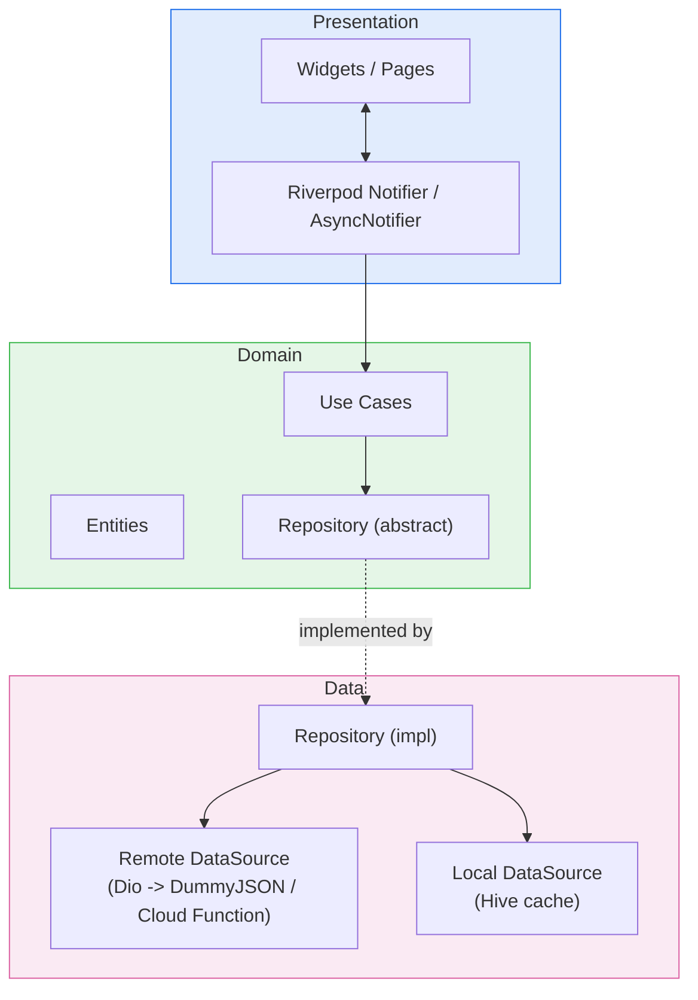

# Velora

An enterprise-grade e-commerce app built with Flutter, showcasing production mobile
architecture on a different stack than a typical portfolio piece: feature-first Clean
Architecture, Riverpod (code-generated) state management, real Firebase Authentication
(Google/Apple/email), and real Stripe payments behind a server-verified Cloud Function —
no mocked backend anywhere in the stack.

Product data comes from the [DummyJSON](https://dummyjson.com) REST API (free, keyless).
Payments run against Stripe **test mode**.

### Supported platforms

iOS and Android only, by design — the app leans on native Google/Apple sign-in flows,
platform Keychain/Keystore-backed session storage, push notifications, and a bottom-nav
mobile layout that wouldn't translate to web/desktop without real rework.

## Features

- **Authentication** — Firebase Auth with real Google Sign-In, real Sign in with Apple, and
  email/password, session persisted natively by the Firebase SDK. Guest cart/wishlist
  contents merge into the account automatically on sign-in.
- **Products** — paginated, infinite-scroll catalog with category filtering, pull-to-refresh,
  skeleton loading, and a detail page with an image carousel, ratings, reviews, and related
  products.
- **Search** — debounced live search with persisted history and suggestions.
- **Cart** — offline-first, quantity management, a small server-side-configurable coupon
  catalog (`SAVE10` / `SAVE20` / `WELCOME15`).
- **Wishlist** — offline-first, synced the same way as the cart on sign-in.
- **Checkout** — cart → address → shipping → payment, with a real Stripe PaymentSheet charge
  behind a `PaymentGateway` abstraction (see [Payments](#payments) below).
- **Orders** — history, detail with a visual tracking stepper (processing → shipped →
  delivered, or cancelled), and cancellation while an order is still processing.
- **Observability** — Crashlytics error reporting, an analytics funnel (sign_up → login →
  search → view_item → add_to_cart → begin_checkout → purchase), FCM + local notifications,
  and one live Remote Config feature flag (`coupons_enabled`).

## Architecture

Each feature is a self-contained vertical slice with its own `data` / `domain` /
`presentation` layers. Cross-feature concerns (networking, DI, error handling, storage,
theming, observability) live in `core`.



The domain layer only depends on abstractions, never on `data`, so use cases and notifiers
are unit-testable with a mocked repository and no Flutter/platform dependency at all.

**Error handling** flows uniformly through the stack as `Either<Failure, T>` (via `dartz`):
data sources throw typed exceptions, a repository maps them to a sealed `Failure` union
(`freezed`), and the presentation layer pattern-matches on `Failure` to render
network/server/cache/validation/payment-specific UI.

**Riverpod patterns**, each used where it fits rather than uniformly:

- Plain synchronous `Notifier` for state that's cheap to compute (`ProductListNotifier`'s
  pagination).
- `AsyncNotifier` for state built from an async call whose mutations also return the new
  state (`CartNotifier`, `CheckoutNotifier`).
- A `Stream`-backed `@riverpod` class for `AuthState`, mirroring Firebase's own
  `userChanges()` stream.
- `Provider` families for parameterized fetches (`productDetailProvider(id)`,
  `orderDetailProvider(id)`).
- `keepAlive: true` reserved for state that must survive being temporarily unwatched
  (`AuthController`, the `router`, cross-feature sync observers) — everything else is
  `autoDispose` by default.
- `ref.select`/family scoping keeps rebuilds narrow — a cart badge watching `.itemCount`
  doesn't rebuild on a coupon change, for example.

**Router**: `go_router`'s `StatefulShellRoute.indexedStack` gives the four bottom-nav tabs
independent navigation stacks. The router provider is built exactly once
(`keepAlive`, no reactive `ref.watch` in its body) and bridges auth-state changes into
`refreshListenable` via a small `ChangeNotifier` — this avoids a router-recreation bug where
watching auth state directly inside the router provider would reset in-flight navigation on
every auth change.

### Payments

The Stripe **secret** key never enters the app. `functions/src/index.ts` is a Firebase Cloud
Function that verifies the caller's Firebase ID token, then creates a Stripe PaymentIntent
server-side and returns only the client secret. The Flutter side (`StripePaymentGateway`)
fetches that secret over an authenticated request, then drives Stripe's native
`PaymentSheet` UI to collect card details and confirm the charge — card details never pass
through this app's own code.

### Dependency injection

Composition happens through plain Riverpod `Provider`s per feature (e.g.
`cart_providers.dart` wires `CartLocalDataSource → CartRepository → use cases`), overridden
at the edges in tests — no service locator.

## Tech stack

Each pick names the alternative it was weighed against, as a trade-off rather than a
verdict:

| Concern | Choice | Why, over the alternative |
|---|---|---|
| State management | `flutter_riverpod` + `riverpod_generator` | Vs. Bloc: compile-safe, code-generated providers cut the boilerplate a full Bloc/Event/State setup needs for simple state, and `Provider` families make parameterized caching (`productDetail(id)`) trivial without a custom cache key scheme. Bloc's explicit event log is nicer for auditing complex multi-step flows, but this app's flows (pagination, debounced search, a payment state machine) map cleanly onto `Notifier`/`AsyncNotifier` without needing that. |
| Immutable models | `freezed` | Generates `copyWith`/equality/union variants for state and the `Failure` type, which is the boilerplate that rots fastest by hand. Pinned to a `3.2.6-dev` prerelease here specifically because `riverpod_generator 4.x` needs `analyzer ^12.0.0`, which stable `freezed` (at the time of writing) caps below. |
| DI | Riverpod `Provider`s | Vs. `get_it`: no service locator, no runtime string/type lookup — composition is just providers depending on providers, and overriding a dependency in a test is a one-line `overrideWithValue`. |
| Networking | `dio` | A real interceptor pipeline (auth header injection from the current Firebase ID token, retry-with-backoff, error normalization to `Failure`, dev-only logging) across every endpoint — `dio` has that built in. |
| Local persistence | `hive` | What's cached (products, cart, wishlist, addresses, orders, search history) is document-shaped, not relational, so Hive keeps it simple. Cart/wishlist/orders/addresses are all keyed per guest-or-uid, so a signed-out cart merges cleanly into the account on login instead of leaking across users on a shared device. |
| Functional error handling | `dartz` (`Either`) | Encourages explicit error propagation through `fold` instead of `try/catch` as primary control flow at the presentation boundary. |
| Routing | `go_router` | `StatefulShellRoute.indexedStack` gives the four bottom-nav tabs independent navigation stacks for free, plus declarative deep-link-ready routes for product/order detail. |
| Payments | `flutter_stripe` + a Firebase Cloud Function | The alternative — creating PaymentIntents client-side — would require embedding a Stripe secret key in the app binary, which Stripe explicitly warns against; a thin server endpoint is the only safe option. |
| Auth | Firebase Auth (Google, Apple, email/password) | One SDK for session persistence, token refresh, and provider linking, instead of hand-rolling three separate OAuth flows and a session store. |
| Observability | Firebase Crashlytics + Analytics + Messaging + Remote Config | One SDK, one project, each wrapped behind a small interface (`AnalyticsService`, `RemoteConfigService`) so tests don't need to know it exists. |

## Project structure

```
lib/
  core/                   # Shared across every feature
    analytics/            # AnalyticsService interface + Firebase impl, auth-change observer
    config/                # Flavors, env loading
    error/                 # Failure union, exception mapping
    network/                # Dio client + interceptors
    notifications/          # FCM + local notifications
    providers/               # Cross-cutting Riverpod providers (Firebase, Dio, Hive boxes)
    remote_config/            # RemoteConfigService interface + Firebase impl
    router/                    # go_router config, shell, route paths
    storage/                    # Hive box registry, secure storage
    sync/                        # Guest-to-user cart/wishlist merge observer
    theme/                        # Material 3 theme, spacing/text-style scales
    usecase/                      # UseCase<Result, Params> base type
  features/
    authentication/
    products/
    categories/
    search/
    cart/
    wishlist/
    checkout/
    payments/
    orders/
    profile/
      data/                 # Models, local/remote data sources, repository impl
      domain/                # Entities, repository interface, use cases
      presentation/           # Riverpod providers/notifiers, pages, widgets
functions/                  # Firebase Cloud Function: creates Stripe PaymentIntents
test/                       # Unit + Riverpod provider + widget tests, mirrors lib/ structure
integration_test/           # End-to-end flows driven on a real device/simulator
```

## Getting started

### Prerequisites

- Flutter 3.44+ (Dart 3.12+)
- An iOS simulator or Android emulator/device
- A [Firebase](https://firebase.google.com) project with Authentication (Google, Apple,
  email/password providers enabled), and the **Blaze** billing plan if you want live payments
  (Cloud Functions need it to call the Stripe API)
- A [Stripe](https://stripe.com) account (test mode is enough)

### Setup

```bash
git clone <this-repo>
cd ecommerce_app
flutter pub get

# Environment config
cp assets/env/.env.example assets/env/.env.development
cp assets/env/.env.example assets/env/.env.production
# API_BASE_URL is DummyJSON's public API - no key required, works out of the box.

# Firebase
dart pub global activate flutterfire_cli
flutterfire configure

# Generate freezed/json_serializable/riverpod code
dart run build_runner build --delete-conflicting-outputs
```

### Payments (optional — the app runs fine without this, checkout just can't charge a card)

```bash
cd functions
npm install
firebase functions:secrets:set STRIPE_SECRET_KEY   # paste your sk_test_... key
firebase deploy --only functions
```

Then fill in `STRIPE_PUBLISHABLE_KEY` (your `pk_test_...` key) and `PAYMENTS_FUNCTION_URL`
(the deployed function's URL) in `assets/env/.env.development`.

### Run

```bash
flutter run -t lib/main_development.dart   # development flavor
flutter run -t lib/main_production.dart    # production flavor
```

## Testing

**46 unit/Riverpod-provider/widget tests** (mocktail) covering repository cache-fallback
logic, use cases, notifier state machines (pagination, debounce, the checkout
payment/order flow), and key widgets, plus a real end-to-end **integration test** that signs
up a real Firebase account, verifies the product catalog loads from the live DummyJSON API,
and signs out — driven on an iOS simulator, not mocked.

```bash
flutter test                                                 # unit + provider + widget tests
flutter test integration_test/auth_flow_test.dart -d <device-id>   # end-to-end flow
```

CI (`.github/workflows/ci.yml`) runs formatting, codegen, analysis, and the full test suite
on every push and pull request, plus a separate job that typechecks the Cloud Function.

## Future improvements

- A real backend-issued order/shipment tracking integration instead of the simulated
  processing → shipped → delivered stepper
- Apple Pay / Google Pay via Stripe's `PaymentSheet` wallet support
- Golden-image tests for the product grid and checkout summary
- A staging Firebase project + a deploy job in CI for the Cloud Function

## License

This project is open source and available for anyone to use as a learning reference or
portfolio starting point.
